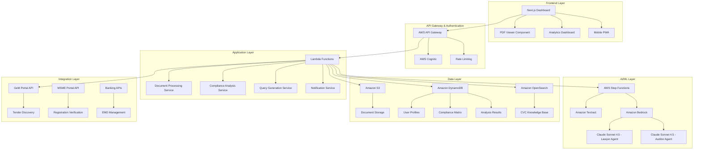

# Design Document: Bid-Shield AI-Powered Tender Compliance Platform

## Overview

Bid-Shield is a cloud-native SaaS platform that leverages advanced AI and AWS services to help SMEs navigate India's complex government procurement landscape. The platform addresses the critical challenge where SMEs face a 90% failure rate in tender bidding, often losing significant EMD amounts (1-5% of tender value) due to hidden compliance issues and restrictive specifications.

The solution combines AWS Textract's advanced document processing capabilities with Amazon Bedrock's Claude Sonnet 4.5 model to create specialized AI agents that analyze tender documents, assess compliance, and generate strategic pre-bid queries to challenge unfair specifications.

**Key Value Proposition:**
- Reduce EMD losses by identifying unwinnable tenders early
- Improve bid-win ratio from industry average <10% to target 20%+
- Save 50+ hours per tender through automated analysis
- Generate legally sound pre-bid queries to level the playing field

## Architecture

### High-Level Architecture

The platform follows a microservices architecture deployed on AWS, designed for scalability, reliability, and cost-effectiveness:



### AWS Services Architecture

**Core Processing Pipeline:**
1. **Document Ingestion**: S3 triggers Lambda on PDF upload
2. **Orchestration**: Step Functions coordinates parallel processing
3. **Text Extraction**: Textract Queries extract structured data
4. **AI Analysis**: Bedrock agents perform specialized analysis
5. **Data Storage**: Results stored in DynamoDB and OpenSearch
6. **User Interface**: Real-time updates via WebSocket API

## Components and Interfaces

### 1. Document Processing Pipeline

**AWS Step Functions Workflow:**
```json
{
  "Comment": "Bid-Shield Document Analysis Workflow",
  "StartAt": "DocumentValidation",
  "States": {
    "DocumentValidation": {
      "Type": "Task",
      "Resource": "arn:aws:lambda:region:account:function:ValidateDocument",
      "Next": "ParallelProcessing"
    },
    "ParallelProcessing": {
      "Type": "Parallel",
      "Branches": [
        {
          "StartAt": "TextractExtraction",
          "States": {
            "TextractExtraction": {
              "Type": "Task",
              "Resource": "arn:aws:states:::aws-sdk:textract:analyzeDocument",
              "Parameters": {
                "Document": {
                  "S3Object": {
                    "Bucket.$": "$.bucket",
                    "Name.$": "$.key"
                  }
                },
                "FeatureTypes": ["QUERIES"],
                "QueriesConfig": {
                  "Queries": [
                    {
                      "Text": "What is the EMD amount?",
                      "Alias": "EMD_AMOUNT"
                    },
                    {
                      "Text": "What is the required annual turnover?",
                      "Alias": "TURNOVER_REQUIREMENT"
                    },
                    {
                      "Text": "What experience criteria are required?",
                      "Alias": "EXPERIENCE_CRITERIA"
                    }
                  ]
                }
              },
              "End": true
            }
          }
        },
        {
          "StartAt": "LawyerAgentAnalysis",
          "States": {
            "LawyerAgentAnalysis": {
              "Type": "Task",
              "Resource": "arn:aws:states:::bedrock:invokeModel",
              "Parameters": {
                "ModelId": "anthropic.claude-sonnet-4-5-v2:0",
                "Body": {
                  "anthropic_version": "bedrock-2023-05-31",
                  "max_tokens": 4000,
                  "messages": [
                    {
                      "role": "user",
                      "content": "Analyze this tender document for CVC compliance violations..."
                    }
                  ]
                }
              },
              "End": true
            }
          }
        }
      ],
      "Next": "ComplianceAssessment"
    }
  }
}
```

### 2. AI Agent System

**Lawyer Agent (Legal Analysis):**
- **Model**: Claude Sonnet 4.5 via Amazon Bedrock
- **Specialization**: CVC guideline compliance, legal precedent analysis
- **Knowledge Base**: Vector database of CVC circulars, court judgments, procurement guidelines
- **Output**: Legal violation flags, pre-bid query drafts, risk assessments

**Auditor Agent (Numerical Compliance):**
- **Model**: Claude Sonnet 4.5 via Amazon Bedrock  
- **Specialization**: Numerical requirement validation, capability matching
- **Input**: Extracted data + user profile
- **Output**: Compliance matrix, success probability scores, gap analysis

### 3. Data Models

**User Profile Schema:**
```typescript
interface UserProfile {
  userId: string;
  companyName: string;
  msmeRegistration?: {
    number: string;
    category: 'MICRO' | 'SMALL' | 'MEDIUM';
    expiryDate: Date;
    verified: boolean;
  };
  financials: {
    annualTurnover: {
      year: number;
      amount: number;
      currency: 'INR';
      verified: boolean;
    }[];
  };
  location: {
    state: string;
    district: string;
    pincode: string;
  };
  certifications: {
    name: string;
    number: string;
    issuingAuthority: string;
    expiryDate: Date;
    verified: boolean;
  }[];
  experience: {
    domain: string;
    years: number;
    projectCount: number;
    totalValue: number;
  }[];
  capabilityScore: number; // 0-100
  createdAt: Date;
  updatedAt: Date;
}
```

**Tender Analysis Schema:**
```typescript
interface TenderAnalysis {
  tenderId: string;
  userId: string;
  documentUrl: string;
  extractedData: {
    emdAmount: number;
    turnoverRequirement: number;
    experienceYears: number;
    mandatoryCertifications: string[];
    locationRestrictions: string[];
    technicalSpecifications: TechnicalSpec[];
  };
  complianceStatus: {
    overall: 'GREEN' | 'YELLOW' | 'RED';
    emdCompliance: ComplianceFlag;
    turnoverCompliance: ComplianceFlag;
    locationCompliance: ComplianceFlag;
    certificationCompliance: ComplianceFlag;
    experienceCompliance: ComplianceFlag;
  };
  legalAnalysis: {
    cvcViolations: CVCViolation[];
    restrictiveSpecs: RestrictiveSpec[];
    riskLevel: 'LOW' | 'MEDIUM' | 'HIGH';
  };
  recommendations: {
    bidDecision: 'PROCEED' | 'CAUTION' | 'AVOID';
    successProbability: number; // 0-100
    estimatedPreparationTime: number; // hours
    preBidQueries: PreBidQuery[];
  };
  financialImpact: {
    emdExposure: number;
    potentialContractValue: number;
    estimatedROI: number;
  };
  processedAt: Date;
  version: string;
}
```

**Pre-Bid Query Schema:**
```typescript
interface PreBidQuery {
  queryId: string;
  tenderId: string;
  violationType: 'CVC_VIOLATION' | 'ANTI_COMPETITIVE' | 'EXCESSIVE_REQUIREMENT';
  title: string;
  description: string;
  legalBasis: {
    cvcCircular?: string;
    courtJudgment?: string;
    procurementRule?: string;
  };
  suggestedAmendment: string;
  priority: 'HIGH' | 'MEDIUM' | 'LOW';
  successProbability: number;
  generatedQuery: string;
  status: 'DRAFT' | 'SUBMITTED' | 'RESPONDED' | 'ACCEPTED' | 'REJECTED';
  createdAt: Date;
}
```

### 4. API Design

**RESTful API Endpoints:**

```typescript
// Document Management
POST /api/v1/documents/upload
GET /api/v1/documents/{documentId}
DELETE /api/v1/documents/{documentId}

// Tender Analysis
POST /api/v1/analysis/start
GET /api/v1/analysis/{analysisId}
GET /api/v1/analysis/user/{userId}

// Compliance Assessment
GET /api/v1/compliance/{tenderId}
POST /api/v1/compliance/bulk-check

// Pre-bid Queries
GET /api/v1/queries/{tenderId}
POST /api/v1/queries/generate
PUT /api/v1/queries/{queryId}

// User Profile
GET /api/v1/profile
PUT /api/v1/profile
POST /api/v1/profile/verify-msme

// Dashboard & Analytics
GET /api/v1/dashboard/summary
GET /api/v1/analytics/performance
GET /api/v1/analytics/savings

// Tender Discovery
GET /api/v1/tenders/discover
POST /api/v1/tenders/watchlist
GET /api/v1/tenders/recommendations
```

**WebSocket API for Real-time Updates:**
```typescript
// Connection Management
wss://api.bidshield.com/ws/{userId}

// Message Types
interface WebSocketMessage {
  type: 'ANALYSIS_PROGRESS' | 'ANALYSIS_COMPLETE' | 'NEW_TENDER_MATCH' | 'QUERY_RESPONSE';
  payload: any;
  timestamp: Date;
}
```

## Correctness Properties

*A property is a characteristic or behavior that should hold true across all valid executions of a system—essentially, a formal statement about what the system should do. Properties serve as the bridge between human-readable specifications and machine-verifiable correctness guarantees.*

Based on the requirements analysis, the following correctness properties must be validated through property-based testing:

### Property 1: File Upload Validation and Processing
*For any* file upload request, the system should accept files up to 100MB and reject larger files, while supporting batch uploads of up to 10 documents simultaneously
**Validates: Requirements 1.1, 1.5**

### Property 2: Document Processing Timeliness
*For any* uploaded document, automated processing should begin within 30 seconds and provide real-time status updates throughout the process
**Validates: Requirements 1.2, 1.3**

### Property 3: Error Handling Consistency
*For any* invalid or corrupted file upload, the system should return specific error messages with actionable resolution steps
**Validates: Requirements 1.4**

### Property 4: Data Extraction Accuracy
*For any* tender document containing EMD amounts, turnover requirements, or experience criteria, the system should extract these values with at least 95% accuracy using Textract Queries
**Validates: Requirements 2.1, 2.2, 2.3**

### Property 5: Data Transformation and Storage
*For any* successfully processed document, extracted data should be converted to structured JSON format and stored in DynamoDB with proper tender ID mapping
**Validates: Requirements 2.4, 2.5**

### Property 6: Profile Validation and MSME Benefits
*For any* user profile with valid MSME registration, the system should automatically flag EMD exemption eligibility and validate required financial data
**Validates: Requirements 3.1, 3.2**

### Property 7: Compliance Assessment Logic
*For any* tender analysis, the system should compare all extracted requirements against user profile data and assign appropriate risk levels (RED/YELLOW/GREEN) based on capability gaps
**Validates: Requirements 4.1, 4.2, 4.3**

### Property 8: Success Probability Calculation
*For any* completed compliance assessment, the system should calculate a bid success probability score between 0-100% that correlates with compliance status and historical data
**Validates: Requirements 4.4**

### Property 9: Legal Analysis and CVC Compliance
*For any* tender document, the Lawyer Agent should identify CVC guideline violations and flag them with specific circular references and legal precedents
**Validates: Requirements 5.1, 5.2**

### Property 10: Pre-bid Query Generation
*For any* identified CVC violation, the system should generate legally sound pre-bid queries with proper citations to CVC circulars and court precedents
**Validates: Requirements 6.1, 6.2**

### Property 11: PDF Viewer Functionality
*For any* uploaded PDF document, the system should render it in a responsive viewer with zoom, navigation, and color-coded compliance overlays
**Validates: Requirements 7.1, 7.2**

### Property 12: Dashboard Data Accuracy
*For any* user accessing the dashboard, the system should display accurate traffic light summaries of all analyzed tenders with correct success probability scores
**Validates: Requirements 8.1**

### Property 13: Financial Calculations
*For any* set of analyzed tenders, the system should accurately calculate EMD savings from avoided bad bids and total time savings in hours
**Validates: Requirements 8.2, 13.1**

### Property 14: Data Security and Encryption
*For any* sensitive user data stored in the system, it should be encrypted at rest using AWS KMS with customer-managed keys
**Validates: Requirements 9.1**

### Property 15: Audit Logging Completeness
*For any* data access operation, the system should log the activity with timestamp, IP address, user ID, and action details
**Validates: Requirements 9.2**

### Property 16: Processing Performance
*For any* document up to 100MB, the system should complete analysis within 5 minutes using parallel processing workflows
**Validates: Requirements 10.1**

### Property 17: Concurrent User Support
*For any* system load up to 500 concurrent users, performance should remain within acceptable limits without degradation
**Validates: Requirements 10.2**

### Property 18: Automated Tender Discovery
*For any* new tender published on monitored portals, the system should detect and analyze it within 2 hours of publication
**Validates: Requirements 11.1**

### Property 19: Tender Matching Algorithm
*For any* discovered tender, the system should calculate accurate match scores based on user profile attributes including location, capability, and experience
**Validates: Requirements 11.2**

### Property 20: Role-Based Access Control
*For any* team member invitation, the system should enforce appropriate permissions based on assigned roles (Admin, Analyst, Viewer)
**Validates: Requirements 12.1**

### Property 21: Mobile Responsiveness
*For any* mobile device access, the system should provide a fully functional responsive interface optimized for touch interaction
**Validates: Requirements 14.1**

## Error Handling

### Error Classification and Response Strategy

**1. User Input Errors (4xx)**
- **File Upload Errors**: Invalid format, size exceeded, corrupted files
- **Profile Validation Errors**: Missing required fields, invalid data formats
- **Authentication Errors**: Invalid credentials, expired tokens
- **Response**: Immediate user feedback with specific resolution steps

**2. System Processing Errors (5xx)**
- **Textract Processing Failures**: Document parsing errors, service limits
- **Bedrock API Errors**: Model unavailability, token limits, rate limiting
- **Database Errors**: Connection failures, constraint violations
- **Response**: Automatic retry with exponential backoff, fallback mechanisms

**3. Integration Errors**
- **External API Failures**: GeM portal unavailable, MSME verification service down
- **AWS Service Outages**: S3 unavailability, DynamoDB throttling
- **Response**: Circuit breaker pattern, graceful degradation

### Error Handling Patterns

**Circuit Breaker Implementation:**
```typescript
class CircuitBreaker {
  private failureCount = 0;
  private lastFailureTime?: Date;
  private state: 'CLOSED' | 'OPEN' | 'HALF_OPEN' = 'CLOSED';
  
  async execute<T>(operation: () => Promise<T>): Promise<T> {
    if (this.state === 'OPEN') {
      if (this.shouldAttemptReset()) {
        this.state = 'HALF_OPEN';
      } else {
        throw new Error('Circuit breaker is OPEN');
      }
    }
    
    try {
      const result = await operation();
      this.onSuccess();
      return result;
    } catch (error) {
      this.onFailure();
      throw error;
    }
  }
}
```

**Retry Strategy with Exponential Backoff:**
```typescript
async function retryWithBackoff<T>(
  operation: () => Promise<T>,
  maxRetries: number = 3,
  baseDelay: number = 1000
): Promise<T> {
  for (let attempt = 1; attempt <= maxRetries; attempt++) {
    try {
      return await operation();
    } catch (error) {
      if (attempt === maxRetries) throw error;
      
      const delay = baseDelay * Math.pow(2, attempt - 1);
      await new Promise(resolve => setTimeout(resolve, delay));
    }
  }
  throw new Error('Max retries exceeded');
}
```

### Error Recovery Mechanisms

**1. Document Processing Failures**
- **Partial Processing**: Save successfully extracted data, flag failed sections
- **Alternative Extraction**: Fallback to basic OCR if Textract Queries fail
- **Manual Review Queue**: Route complex documents to human review

**2. AI Agent Failures**
- **Model Fallback**: Switch to alternative Claude model versions
- **Simplified Analysis**: Provide basic compliance check without advanced legal analysis
- **Cached Results**: Use similar document analysis results when available

**3. Data Consistency**
- **Transaction Rollback**: Ensure atomic operations across DynamoDB tables
- **Event Sourcing**: Maintain event log for data reconstruction
- **Conflict Resolution**: Handle concurrent updates with optimistic locking

## Testing Strategy

### Dual Testing Approach

The testing strategy combines traditional unit testing with property-based testing to ensure comprehensive coverage and correctness validation:

**Unit Testing Focus:**
- Specific business logic scenarios and edge cases
- Integration points between AWS services
- Error handling and recovery mechanisms
- User interface components and interactions

**Property-Based Testing Focus:**
- Universal properties that must hold across all inputs
- Data transformation correctness
- Compliance assessment logic validation
- Performance characteristics under load

### Property-Based Testing Implementation

**Framework Selection:** 
- **Primary**: Hypothesis (Python) for backend services
- **Secondary**: fast-check (TypeScript) for frontend components
- **Integration**: Custom AWS Step Functions testing framework

**Test Configuration:**
- **Minimum Iterations**: 100 per property test (due to randomization)
- **Timeout**: 30 seconds per property test
- **Shrinking**: Enabled for minimal counterexample generation
- **Seed Management**: Reproducible test runs with fixed seeds

**Property Test Examples:**

```python
from hypothesis import given, strategies as st
import pytest

@given(st.binary(min_size=1, max_size=100*1024*1024))  # Up to 100MB
def test_file_upload_size_validation(file_data):
    """Property 1: File Upload Validation and Processing"""
    result = upload_service.validate_file_size(file_data)
    
    if len(file_data) <= 100*1024*1024:
        assert result.is_valid == True
    else:
        assert result.is_valid == False
        assert "exceeds maximum size" in result.error_message

@given(st.lists(st.binary(min_size=1000), min_size=1, max_size=15))
def test_batch_upload_limits(file_list):
    """Property 1: Batch Upload Validation"""
    result = upload_service.validate_batch_upload(file_list)
    
    if len(file_list) <= 10:
        assert result.is_valid == True
    else:
        assert result.is_valid == False
        assert "exceeds batch limit" in result.error_message

@given(st.floats(min_value=0, max_value=1000000000))  # Turnover amounts
def test_compliance_assessment_logic(user_turnover, tender_requirement):
    """Property 7: Compliance Assessment Logic"""
    gap_percentage = (tender_requirement - user_turnover) / tender_requirement * 100
    
    result = compliance_service.assess_turnover_compliance(user_turnover, tender_requirement)
    
    if gap_percentage > 20:
        assert result.status == 'RED'
        assert 'EMD loss risk' in result.warning
    elif gap_percentage > 0:
        assert result.status == 'YELLOW'
    else:
        assert result.status == 'GREEN'
        assert result.confidence_percentage > 0

@given(st.integers(min_value=0, max_value=100))
def test_success_probability_bounds(compliance_score):
    """Property 8: Success Probability Calculation"""
    result = analysis_service.calculate_success_probability(compliance_score)
    
    assert 0 <= result <= 100
    assert isinstance(result, (int, float))
```

**Tag Format for Property Tests:**
Each property test must include a comment tag referencing the design document:
```python
# Feature: bid-shield, Property 1: File Upload Validation and Processing
# Feature: bid-shield, Property 7: Compliance Assessment Logic  
# Feature: bid-shield, Property 8: Success Probability Calculation
```

### Unit Testing Strategy

**Test Categories:**

1. **Component Tests**
   - Individual Lambda function testing
   - API endpoint validation
   - Database operation verification

2. **Integration Tests**
   - AWS service integration (Textract, Bedrock, S3)
   - External API integration (GeM, MSME portals)
   - End-to-end workflow validation

3. **UI Tests**
   - React component testing with Jest/React Testing Library
   - PDF viewer functionality
   - Dashboard data visualization

4. **Performance Tests**
   - Load testing with Artillery.js
   - Concurrent user simulation
   - Memory and CPU usage monitoring

**Example Unit Tests:**

```typescript
describe('Document Processing Service', () => {
  it('should extract EMD amount from standard tender format', async () => {
    const mockDocument = createMockTenderDocument({
      emdAmount: '₹50,000',
      format: 'STANDARD_GOV_TEMPLATE'
    });
    
    const result = await documentProcessor.extractEMDAmount(mockDocument);
    
    expect(result.amount).toBe(50000);
    expect(result.currency).toBe('INR');
    expect(result.confidence).toBeGreaterThan(0.95);
  });

  it('should handle corrupted PDF gracefully', async () => {
    const corruptedPDF = Buffer.from('invalid pdf content');
    
    const result = await documentProcessor.processDocument(corruptedPDF);
    
    expect(result.success).toBe(false);
    expect(result.error).toContain('corrupted or invalid format');
    expect(result.suggestedActions).toContain('re-upload');
  });
});

describe('Compliance Assessment', () => {
  it('should flag high-risk tenders correctly', () => {
    const userProfile = createMockUserProfile({
      annualTurnover: 1000000, // 10 Lakh
      location: 'Maharashtra'
    });
    
    const tenderRequirements = createMockTenderRequirements({
      minimumTurnover: 5000000, // 50 Lakh (5x user capability)
      location: 'Maharashtra'
    });
    
    const assessment = complianceService.assessCompliance(userProfile, tenderRequirements);
    
    expect(assessment.overallStatus).toBe('RED');
    expect(assessment.turnoverCompliance.status).toBe('RED');
    expect(assessment.riskWarnings).toContain('EMD loss risk');
  });
});
```

### Testing Infrastructure

**Continuous Integration Pipeline:**
```yaml
# .github/workflows/test.yml
name: Comprehensive Testing Pipeline

on: [push, pull_request]

jobs:
  unit-tests:
    runs-on: ubuntu-latest
    steps:
      - uses: actions/checkout@v3
      - name: Run Unit Tests
        run: |
          npm test
          python -m pytest tests/unit/
  
  property-tests:
    runs-on: ubuntu-latest
    steps:
      - uses: actions/checkout@v3
      - name: Run Property-Based Tests
        run: |
          python -m pytest tests/properties/ --hypothesis-profile=ci
          npm run test:properties
  
  integration-tests:
    runs-on: ubuntu-latest
    needs: [unit-tests, property-tests]
    steps:
      - name: Deploy Test Environment
        run: cdk deploy --context env=test
      - name: Run Integration Tests
        run: npm run test:integration
      - name: Cleanup Test Environment
        run: cdk destroy --context env=test --force
```

**Test Data Management:**
- **Synthetic Data Generation**: Create realistic tender documents for testing
- **Anonymized Production Data**: Use sanitized real tender data for edge case testing
- **Mock Services**: Simulate external API responses for consistent testing

### Quality Assurance Metrics

**Coverage Targets:**
- Unit Test Coverage: >90%
- Property Test Coverage: 100% of identified properties
- Integration Test Coverage: >80% of critical paths
- End-to-End Test Coverage: >70% of user journeys

**Performance Benchmarks:**
- Document Processing: <5 minutes for 100MB files
- API Response Time: <2 seconds for 95th percentile
- Concurrent Users: 500 users without degradation
- System Availability: 99.5% uptime during business hours

This comprehensive testing strategy ensures that Bid-Shield meets the high reliability and accuracy standards required for SMEs to trust the platform with critical business decisions involving significant financial commitments.